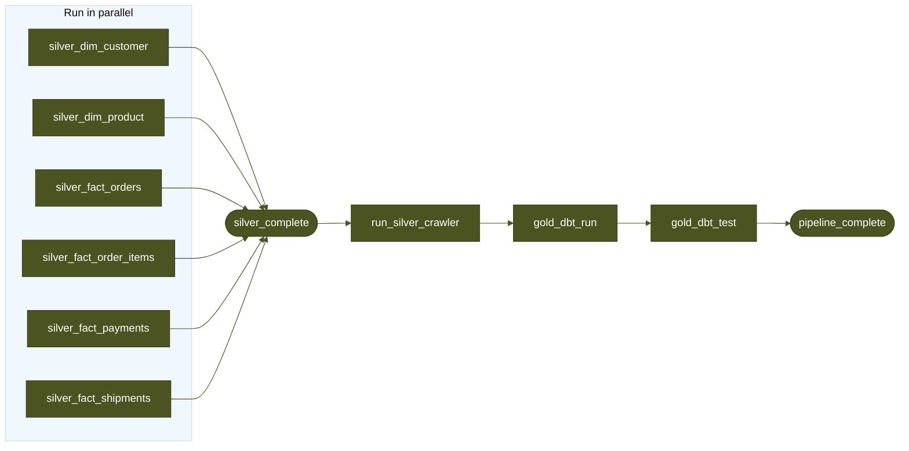
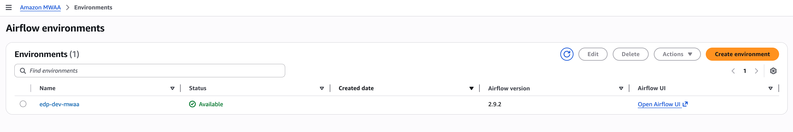

# platform-orchestration-mwaa-airflow

This repository is part of the [Enterprise Data Platform](https://github.com/enterprise-data-platform-emeka/platform-docs). For the full project overview, architecture diagram, and build order, start there.

**Previous:** [platform-dbt-analytics](https://github.com/enterprise-data-platform-emeka/platform-dbt-analytics): that repo defines the dbt models that the DAG orchestrated here runs on every pipeline execution.

---

**Orchestrator note:** The platform supports two pipeline orchestrators. This repo covers the **MWAA (Amazon Managed Workflows for Apache Airflow) path**, which is used when recording the YouTube demo because it shows the Airflow UI with a visual graph of task dependencies. For daily development sessions, the platform uses **AWS Step Functions** instead: the `modules/step-functions` Terraform module creates a state machine that runs the same pipeline (6 Silver Glue jobs, Silver crawler, dbt) in ~10 minutes with no 25-minute MWAA startup wait. To switch between them, comment/uncomment the relevant module block in `terraform-platform-infra-live/environments/dev/main.tf` and re-run `terraform apply`.

---

This repo holds the Airflow DAG (Directed Acyclic Graph) that orchestrates the Enterprise Data Platform (EDP) production data pipeline. It runs on MWAA version 2.9.2 and drives the daily Silver and Gold data transformations.

The pipeline follows Medallion Architecture. Raw CDC (Change Data Capture) events land in Bronze S3 (Simple Storage Service) overnight from DMS (Database Migration Service). At 06:00 UTC this DAG kicks off six parallel Glue PySpark jobs that clean and reshape the data into Silver, then dbt (data build tool) runs against Athena to produce Gold aggregates that Redshift Serverless exposes to the BI dashboard.

## Repository layout

```
platform-orchestration-mwaa-airflow/
├── dags/
│   └── edp_pipeline.py        # The main orchestration DAG
├── plugins/
│   └── __init__.py            # Required by MWAA, empty for now
├── dbt/                       # Mount point for platform-dbt-analytics (gitignored)
├── docker-compose.yml         # Local MWAA runner setup
├── requirements.txt           # Pinned packages for MWAA 2.9.2
├── Makefile                   # Shortcuts for local development
├── .env.example               # Template for local credentials
└── .github/
    └── workflows/
        ├── ci.yml             # Validate DAG on every PR and push
        └── deploy.yml         # Sync to MWAA S3 bucket on merge to main
```

## Local development

I use the official AWS MWAA local runner to develop and test DAG changes before pushing to MWAA. The local runner runs the same `amazon/mwaa-local:2_9` Docker image that MWAA uses in production, so import errors and provider compatibility problems surface locally rather than after a 20-minute MWAA environment update.

### Prerequisites

- Docker Desktop (running)
- AWS credentials for the `dev-admin` profile (or any profile with access to the dev environment)
- `platform-dbt-analytics` repo available locally (for Gold task testing)

### Step 1: Clone this repo

```bash
git clone <repo-url> platform-orchestration-mwaa-airflow
cd platform-orchestration-mwaa-airflow
```

### Step 2: Set up AWS credentials

```bash
cp .env.example .env
```

Open `.env` and fill in your AWS credentials. For temporary SSO (Single Sign-On) credentials:

```bash
aws sso login --profile dev-admin
# Then copy the credentials from:
aws configure export-credentials --profile dev-admin --format env
```

Never commit `.env`. It's in `.gitignore`.

### Step 3: Set up the dbt mount point

The DAG's Gold tasks run dbt inside the container from `/usr/local/airflow/dbt/platform-dbt-analytics`. I mount the `dbt/` directory into that path. The simplest setup is a symlink:

```bash
# From inside platform-orchestration-mwaa-airflow/
ln -s ../../platform-dbt-analytics dbt/platform-dbt-analytics
```

Or clone it directly:

```bash
git clone <dbt-repo-url> dbt/platform-dbt-analytics
```

The `dbt/` directory is gitignored so it doesn't accidentally get committed.

### Step 4: Start the local runner

```bash
make up
```

The webserver starts on `http://localhost:8080`. Default credentials are `admin` / `test`. The first startup takes a minute or two while Docker pulls the image and installs `requirements.txt`.

```bash
make logs      # watch startup output
make webserver # open http://localhost:8080 in your browser (macOS)
make down      # stop the container
```

### Step 5: Set Airflow Variables locally

In the Airflow UI go to Admin → Variables and create:

| Key             | Value           | Description                         |
|-----------------|-----------------|-------------------------------------|
| `mwaa_env`      | `dev`           | Target environment                  |
| `aws_account_id`| `<your-account-id>`  | Your AWS account ID            |

Or set them via the Airflow CLI inside the container:

```bash
docker compose exec local-runner airflow variables set mwaa_env dev
docker compose exec local-runner airflow variables set aws_account_id <your-account-id>
```

### DAG hot-reload

The `dags/` directory is mounted into the container. Save a change to `edp_pipeline.py` and the scheduler picks it up within ~30 seconds. No restart needed.

If you change `requirements.txt`, restart the container so the new packages install:

```bash
make down && make up
```

## DAG overview

**DAG ID:** `edp_pipeline`
**Schedule:** `0 6 * * *` (06:00 UTC daily)
**Catchup:** disabled (no backfill on first deploy)
**Max active runs:** 1 (prevents overlapping pipeline runs)

### Task breakdown



**Silver tasks (parallel):** Six `GlueJobOperator` tasks trigger the corresponding Glue jobs. They run in parallel because each job reads from an independent Bronze partition (one per DMS table). `wait_for_completion=True` means Airflow polls the Glue API until the job finishes. If a Glue job fails, the task retries once after 5 minutes.

**silver_complete:** An `EmptyOperator` join point. All six Silver tasks must succeed before anything downstream starts.

**run_silver_crawler:** A `GlueCrawlerOperator` that runs the Silver Glue Crawler after all Silver jobs complete. This updates the Glue Catalog with any new partitions written to Silver, so Athena sees the latest data when dbt runs.

**gold_dbt_run:** A `BashOperator` that sets up the dbt workspace and runs `dbt deps` then `dbt run`. At the start of the task, it runs `aws s3 sync s3://{mwaa-bucket}/dbt/platform-dbt-analytics/ /tmp/dbt_workspace/` to download the latest dbt project from S3. This means dbt model changes deployed by the `platform-dbt-analytics` CI take effect on the next DAG run with no MWAA environment update needed. Locally, the project is copied from the Docker volume mount instead.

**gold_dbt_test:** A `BashOperator` that runs `dbt test --target {mwaa_env}` against the Gold models written by `gold_dbt_run`. Runs sequentially after because tests depend on the tables that `dbt run` produces.

**pipeline_complete:** A final `EmptyOperator` that marks successful pipeline completion. Downstream sensors or notification tasks attach here.

### Airflow Variables

The DAG reads two Airflow Variables at parse time:

| Variable        | Required | Default | Description                                               |
|-----------------|----------|---------|-----------------------------------------------------------|
| `mwaa_env`      | Yes      | `dev`   | Sets Glue job names and dbt target (`dev`/`staging`/`prod`) |
| `aws_account_id`| No       | none    | Used for constructing S3 bucket names in logs/alerts      |

Set these in Admin → Variables in the Airflow UI, or via the CLI:

```bash
airflow variables set mwaa_env dev
```

## MWAA environment and DAG

The `edp-dev-mwaa` environment runs Airflow 2.9.2 on MWAA. After the DAG deploys, the full pipeline runs end-to-end with all 11 tasks green.




---

## How to deploy to MWAA

The CI/CD pipeline handles all deployment automatically. Here's how it works:

### What each repo owns

| Artifact | Owner | Update cost |
|---|---|---|
| DAGs (`dags/`) | This repo | ~30 seconds (S3 sync) |
| `requirements.txt` | Terraform (`modules/orchestration/requirements.txt`) | ~35 minutes (terraform apply, only when packages change) |
| `plugins.zip` | Terraform only | Permanent placeholder, never updated by any pipeline |
| dbt project files | `platform-dbt-analytics` repo | Seconds (S3 sync to `s3://{mwaa-bucket}/dbt/platform-dbt-analytics/`) |

The MWAA runtime environment, including Python packages, is infrastructure. Terraform owns `requirements.txt` and creates MWAA with all packages already installed. This repo's CI pipeline only uploads DAG files. It never calls `aws mwaa update-environment`. A 35-minute MWAA update only happens when a package change goes through `terraform apply`, which is rare.

### On push to main

1. CI validates the DAG (lint + import check).
2. CI passes → Deploy workflow triggers automatically.
3. DAGs sync to S3. MWAA picks them up within ~30 seconds. Done.

The deploy workflow does nothing else. No requirements upload. No `aws mwaa update-environment` call. Python packages are owned by Terraform and installed when MWAA is first created.

### Promotion to staging and prod

Trigger the Deploy workflow manually from GitHub Actions and choose the target environment. GitHub Environment protection rules require reviewer approval for staging and prod.

### Manual deployment (if needed)

```bash
aws sso login --profile dev-admin

ACCOUNT_ID=$(aws sts get-caller-identity --profile dev-admin --query Account --output text)
ENV=dev
BUCKET="edp-${ENV}-${ACCOUNT_ID}-mwaa-dags"

# Sync DAGs (picked up by MWAA within ~30 seconds)
aws s3 sync dags/ s3://${BUCKET}/dags/ --delete --profile dev-admin
```

To change Python packages: update `modules/orchestration/requirements.txt` in `terraform-platform-infra-live` and run `terraform apply`. Terraform uploads the new version and triggers the MWAA environment update (~35 min).

To update the dbt project on MWAA workers: push to `platform-dbt-analytics`. Its deploy workflow syncs the project to `s3://${BUCKET}/dbt/platform-dbt-analytics/` in seconds with no MWAA environment update needed.

### First deploy after a fresh infrastructure apply

After `make apply dev` creates a new MWAA environment, follow this sequence entirely from GitHub Actions:

1. Terraform apply creates MWAA with packages already installed. MWAA takes ~20-30 min to reach Available status.
2. Trigger the `platform-dbt-analytics` deploy workflow (auto on push, or manually). The dbt project syncs to S3 in seconds. The `run-dbt` job will fail because Silver tables don't exist yet. That is expected.
3. Trigger this repo's deploy workflow (auto on push, or manually). DAGs upload to S3 (~30 seconds). No MWAA update triggered.
4. After MWAA is Available: trigger the `edp_pipeline` DAG in the Airflow UI. Glue jobs populate Silver, dbt runs inside MWAA to produce Gold.
5. Re-trigger `platform-dbt-analytics` deploy workflow manually. The `run-dbt` job now succeeds because Silver data exists.

There is no 35-minute MWAA update in this sequence. Terraform installs packages during environment creation. The only time a 35-minute update happens is when Python packages actually change, which goes through `terraform apply` not through this repo's CI.

## Updating Python packages

Python packages for MWAA are managed by Terraform, not by this repo's CI. To add or change a package:

1. Check it against the MWAA 2.9.2 constraints file:
   `https://raw.githubusercontent.com/apache/airflow/constraints-2.9.2/constraints-3.11.txt`
2. Test the install locally with `make down && make up` using the `requirements.txt` in this repo.
3. Verify the DAG still imports cleanly.
4. Update `modules/orchestration/requirements.txt` in `terraform-platform-infra-live` with the same change.
5. Update `requirements.txt` in this repo so local development stays in sync.
6. Run `terraform apply` in `terraform-platform-infra-live`. Terraform uploads the new file and triggers a MWAA environment update (~35 min). This is a deliberate infrastructure change.

A bad `requirements.txt` can cause a MWAA environment update failure that takes 20+ minutes to detect. Test locally first.

## CI/CD

CI skips runs triggered by README, `.env.example`, or `plugins.zip` changes. Only DAG code, plugins, requirements, and workflow file changes trigger the pipeline.

### On every pull request and push to main

Two jobs run in parallel:

| Job | What it checks |
|---|---|
| Lint and security scan | ruff checks `dags/` and `plugins/` for style. bandit scans the same paths for MEDIUM and HIGH severity security issues. |
| Validate DAG | Installs `apache-airflow==2.9.2` + Amazon provider, imports `edp_pipeline.py` directly, then runs `airflow dags list` to confirm zero import errors. |

No real AWS calls happen in CI. The DAG uses `Variable.get("mwaa_env", default_var="dev")` so it parses without a live Airflow database or AWS connection.

### On merge to main

The deploy workflow triggers automatically after CI passes. It syncs `dags/` to the MWAA S3 (Simple Storage Service) bucket in dev. MWAA picks up new DAG files within ~30 seconds. That is the entire deploy. The workflow never uploads `requirements.txt` and never calls `aws mwaa update-environment`. Python packages are managed by Terraform. Authentication uses OIDC (OpenID Connect), no long-lived AWS credentials are stored anywhere. To update dbt on MWAA workers, push to `platform-dbt-analytics` (S3 sync, seconds, no MWAA update).

### Promotion to staging and prod

Trigger the Deploy workflow manually from GitHub Actions, choose the target environment. GitHub Environment protection rules require reviewer approval for staging and prod before the job runs.

---

**Next:** [platform-analytics-agent](https://github.com/enterprise-data-platform-emeka/platform-analytics-agent): with Gold data flowing through the orchestrated pipeline, the analytics agent exposes it through a plain-English query interface backed by Claude and a Streamlit browser UI.
